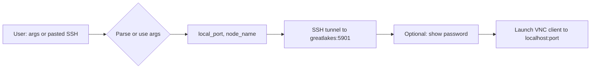

# OnDemand VNC tunnel helper

## Context

- **Existing** [sources/remote_connections_aliases.sh](sources/remote_connections_aliases.sh): `ssh_supercomputer_tunnel` uses **gl-campus-login.arc-ts.umich.edu** and remote VNC port **5902**.
- **OnDemand native VNC** (from [README.md](README.md)) uses **greatlakes.arc-ts.umich.edu** and remote VNC port **5901**, e.g.:
  - `ssh -f -N -L 24104:gl3467.arc-ts.umich.edu:5901 halechr@greatlakes.arc-ts.umich.edu`
  - Then connect VNC client to `localhost:24104` and enter the session password (e.g. `xgMl0NjD`).

The OnDemand dashboard URL does not contain the node name or port; those appear in the session’s “Instructions to connect using native VNC” (user copies the SSH command and password from there).

## Approach

Add one new function that:

1. **Accepts** either:
  - Two args: `node_name` (e.g. `gl3467`), `local_port` (e.g. `24104`), and optionally a third arg for VNC password (for display/reminder only; actually typing it into the VNC client remains manual), or
  - One arg: the **pasted SSH command** from OnDemand (e.g. `ssh -f -N -L 24104:gl3467.arc-ts.umich.edu:5901 halechr@greatlakes.arc-ts.umich.edu`); parse out local port and node name and proceed.
2. **Establishes the tunnel** with the OnDemand-style SSH command: `ssh -f -N -L "${local_port}:${node}.arc-ts.umich.edu:5901" halechr@greatlakes.arc-ts.umich.edu`.
3. **Optionally launches a VNC client** to `localhost:${local_port}` (e.g. TigerVNC: `vncviewer localhost::${local_port}`), with a fallback or env/config for other clients (Remmina, Vinagre) if desired.

No need to fetch or parse the OnDemand HTML; the “link” in the README is only the source of the workflow we’re automating.

## Implementation details

**File to change:** [sources/remote_connections_aliases.sh](sources/remote_connections_aliases.sh)

- **New function** (e.g. `ondemand_vnc_tunnel` or `greatlakes_ondemand_vnc`):
  - **Signature:** `ondemand_vnc_tunnel [local_port node_name | pasted_ssh_command] [vnc_password]`
  - **Detection:** If first argument contains `ssh -f -N -L` and matches a pattern like `-L NNNN:glXXXX.arc-ts.umich.edu:5901`, parse local port and node (e.g. regex or `sed`/`grep`); otherwise treat first two args as `local_port` and `node_name`. Optional third arg = password (echoed once for copy/paste into VNC).
  - **Tunnel:** Run `ssh -f -N -L "${local_port}:${node_name}.arc-ts.umich.edu:5901" halechr@greatlakes.arc-ts.umich.edu` (no 8889 jupyter-lab forward unless you explicitly add it for OnDemand; README doesn’t show it).
  - **VNC launch:** After tunnel is up, run a VNC viewer. Prefer one of:
    - `vncviewer localhost::${local_port}` (TigerVNC; double colon for raw port)
    - Or `remmina -c vnc://localhost:${local_port}` if Remmina is preferred
    - Make this configurable via an env var (e.g. `PHO_VNC_VIEWER`) or a simple “launch” flag so users can skip auto-launch or choose client.
  - **Prompts:** If node or port missing and not parsed, `read -p` for them (consistent with existing `ssh_supercomputer_tunnel`).
- **Comments:** Add a short comment that this is for OnDemand “native VNC” (greatlakes.arc-ts.umich.edu:5901), distinct from the gl-campus-login tunnel.

**Optional:** If you want to avoid running the pasted command string as a full command (security), only **parse** it and then run the fixed `ssh -f -N -L ...` form above; do not `eval` the user’s string.

## Behaviour summary

## README

- Update [README.md](README.md) to replace or supplement the manual “Instructions to connect” with a one-liner that uses the new helper (e.g. paste the SSH command as the single argument, or pass port and node), and note that the VNC password still must be entered in the client.

## Out of scope

- Parsing the OnDemand HTML URL to get node/port (would require auth and scraping).
- Storing or auto-filling the VNC password in the client (client- and security-dependent).

